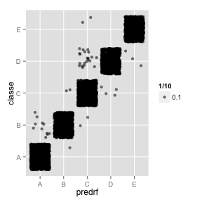

Classifying Barbell Lift Form Using Accelerometers and Random Forests
========================================================
# Summary
A set of 19622 observations of 160 variables were divided into a training set of 13737 observations and a testing set of 5885 observations using random subsampling. A Random Forest model using 5-fold cross validation yeilded 99.4% accuracy and an Out of Sample Error estimate of 0.8%. The model was applied once to a validation set of 20 test cases and correctly predicted each one.
# Methods and Results
First load required packages, and set the seed to the current date. There is a huge difference between the sample size of the testing and training sets. Because the training set is so much larger, it makes sense to split up the training set into training and testing, and use the testing csv as a validation set. We'll also remove the variables that are full of missing values; they're not useful and will slow down model fitting.

```r
library(caret); library(ggplot2); library(rattle)
set.seed(062614)
download.file(url="http://d396qusza40orc.cloudfront.net/predmachlearn/pml-training.csv",destfile="pml-training.csv",method="curl")
download.file(url="http://d396qusza40orc.cloudfront.net/predmachlearn/pml-testing.csv",destfile="pml-testing.csv",method="curl")
trainRaw <- read.csv("pml-training.csv",na.strings=c("NA",""))
NAs <- apply(trainRaw,2,function(x) {sum(is.na(x))}) 
trainClean <- trainRaw[,which(NAs == 0)]
validationRaw <- read.csv("pml-testing.csv",na.strings=c("NA",""))
NAs <- apply(validationRaw,2,function(x) {sum(is.na(x))}) 
validationClean <- validationRaw[,which(NAs == 0)]
```
We'll also remove variables that shouldn't be used as predictors (time, user, window, sequence number).

```r
removeIndex <- grep("timestamp|X|user_name|window",names(trainClean))
trainClean <- trainClean[,-removeIndex]
removeIndex <- grep("timestamp|X|user_name|window",names(validationClean))
validationClean <- validationClean[,-removeIndex]
```
This leaves us with 53 variables to consider as possible predictors. Since our training set is large, let's partition 30% of it into a test set. createDataPartition uses simple random sampling.

```r
inTrain <- createDataPartition(y=trainClean$classe,p=0.7,list=FALSE)
training <- trainClean[inTrain,]
testing <- trainClean[-inTrain,]
```
Our training set now has 53 variables and 13,737 observations. Let's fit a random forest model using 5-fold cross validation.

```r
modrf = train(classe~., method="rf", data=training, trControl = trainControl(method = "cv", number = 5, verboseIter=T))
predrf = predict(modrf,testing)
accurf = (testing$classe == predrf); length(accurf[accurf == TRUE])/length(accurf)
```

```r
qplot(predrf,classe,data=testing,geom="jitter",alpha=1/10)
```

 

```r
modrf$finalModel
```

```
## 
## Call:
##  randomForest(x = x, y = y, mtry = param$mtry) 
##                Type of random forest: classification
##                      Number of trees: 500
## No. of variables tried at each split: 27
## 
##         OOB estimate of  error rate: 0.82%
## Confusion matrix:
##      A    B    C    D    E class.error
## A 3901    3    1    0    1    0.001280
## B   21 2624   12    1    0    0.012792
## C    0   15 2372    9    0    0.010017
## D    1    1   29 2219    2    0.014654
## E    0    2    5    9 2509    0.006337
```
The model's accuracy is 99.4%, and the OOB Error rate is 0.78%. This is a good model and we could be content with it, but let's try a gradient boosting model.

```r
modgbm = train(classe~., method="gbm",data=training, trControl = trainControl(method = "cv", number = 5, verboseIter=T))
predgbm = predict(modgbm,testing)
accugbm = (testing$classe == predgbm); length(accugbm[accugbm == TRUE])/length(accugbm)
```
The accuracy is 96.2%, not as good as the random forest model. Still, we can still make use of this model by stacking it with the random forest to see if overall accuracy improves:

```r
preddf = data.frame(predrf,predgbm,classe=testing$classe)
modcomb = train(classe~.,method="rf",data=preddf,trControl = trainControl(method = "cv", number = 5, verboseIter=T))
predcomb = predict(modcomb,preddf)
accucomb = (testing$classe == predcomb); length(accucomb[accucomb == TRUE])/length(accucomb)
```
The combined accuracy (99.4%) isn't any better than the random forests model alone. Since the stacked model is less interpretable and no more accurate than the Random Forest model, we should disregard the stacked model and stick with the Random Forest model.
